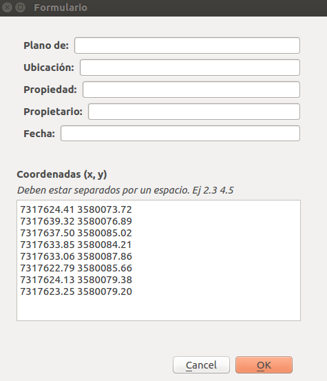

# Proyecto: Topography report (Reporte topográfico)
## Descripción
Realiza un reporte de topología en formato PDF dado una lista de coordenadas.

Dado una lista de puntos [P1, P2, ..., PN] donde Pi es la coordenada (xi, yi) para _**i = 1..N**_ que representa puntos de un polígono en un plano 2D.

_**Nota**: Para el cliente el eje X es vertical y el eje Y horizontal tal como se muestra en la imagen. Además los puntos se dan en sentido horario._

El programa calcula los valores de:
* Ángulos internos
* Azimuts
* Distancia de P1 a P2, de P2 a P3, ..., de PN a P1
* Perímetro
* Superficie del polígono

Tiene la opción de llenar un formulario el cual consta de:
* Plano de...
* Propiedad
* Ubicación
* Perito _(el cual por defecto es el nombre de mi cliente)_
* Propietario
* Fecha

También muestra una aproximación al polígono original.

_**Nota**: Dado que las coordenadas tienen 7 dígitos como parte entera y 2 decimales, el polígono graficado usa como coordenadas los últimos 3 dígitos de la parte entera y los 2 dígitos de parte decimal. Por ejemplo si la coordenada es (1234567.89, 9876543.21) se usará (567.89, 543.21). Pero esto afecta a la hora de graficar, **NO** afecta a los cálculos._
